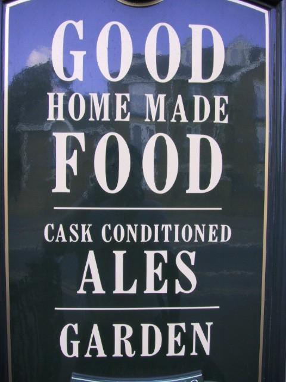
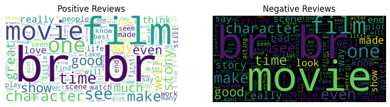
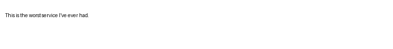
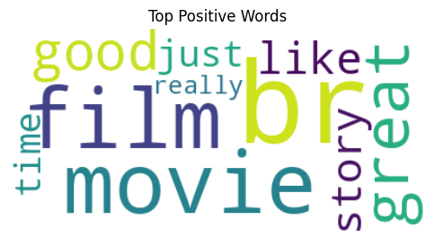
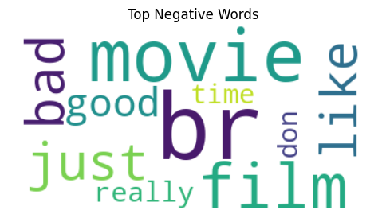

# Natural Language Processing Report

## **Real time OCR + NLP**

<u> Group members </u>

- Kotthagattu Meher Sai **(21MCME07)**
- Arun Velnore **(23MCMI01)**

<hr/>

## About the project

In this project we extract the text from image using the OCR and then on this text we perform some NLP downstream tasks like
**sentiment analysis** and **keyword-extraction**.

    Pipeline:
        Image → OCR → Text → NLP tasks
<hr/>

## Libraries used
- pytesseract - **OCR**
- wordcloud - **Words visualization**
- pandas - **Handling the datasets**
- transformers - **An Huggingface library for different transformer based models**
- scikit-learn - **For TfIdf vectorization**
- spaCy - **For Keyword Extraction**
- nltk(pos_tag, wordtokenize) - **For POS Tagging**
- rake_nltk - **For Ranked Keyword Extraction**
- yake - **For Ranked Keyword Extraction**
<hr/>

## Datasets used
- ICDAR 2013 scene tast (For OCR evaluation)
- IMdB dataset (for sentiment analysis)
- Synthesised images (used for sentiment analysis and keyword extraction)

<hr/>

## Analysis work

*OCR extraction of text and Sentiment analysis evaluation* - **Kotthagattu Meher Sai (21MCME07)**

*OCR Model Evaluation and Keyword Extraction* - **Arun Velnore (23MCMI01)**

<hr/>

## Methodology

Our pipeline first detect text from image by OCR and then using this text we do **sentiment analysis** and **keyword extraction**.

## **OCR** 

In OCR, we perform an end-to-end evaluation of Tesseract OCR accuracy by comparing extracted text from images against ground truth annotations.

The process is as follows:
1. **Text Cleaning Function** `(clean_ocr_text)`

This function standardizes and cleans both the OCR output and the ground truth text:

- Converts text to lowercase.

- Removes non-ASCII characters and unnecessary punctuation/brackets.

- Tokenizes the text and removes English stopwords using NLTK.

- Lemmatizes tokens to their base forms (e.g., "running" → "run").

This ensures both OCR and ground-truth texts are in a comparable form before evaluation.

```python
def clean_ocr_text(raw_text):
    text = raw_text.lower()
    text = re.sub(r'[^\x00-\x7F]+', ' ', text)         # Remove non-ASCII
    text = re.sub(r'\s+', ' ', text).strip()           # Normalize spaces
    text = re.sub(r'[\[\]\(\)\{\}<>]', '', text)       # Remove brackets
    text = re.sub(r'[^a-zA-Z0-9.,$:%\- ]', '', text)   # Clean up symbols

    tokens = word_tokenize(text)
    stop_words = set(stopwords.words('english'))
    tokens = [w for w in tokens if w not in stop_words]

    lemmatizer = WordNetLemmatizer()
    tokens = [lemmatizer.lemmatize(w) for w in tokens]

    return ' '.join(tokens)
```

2. **OCR Preprocessing and Text Extraction**

The following steps summarize the OCR process:

1. **Image Preprocessing**:
   - Convert the image to grayscale.
   - Apply Otsu's thresholding and binary inversion.
   - Use dilation with a rectangular kernel to group text regions.

2. **Contour Detection**:
   - Detect contours corresponding to text blocks.
   - Crop each text block and pass it to Tesseract OCR for text extraction.

3. **Text Cleaning**:
   - Clean the extracted text using the `clean_ocr_text()` function.

4. **Ground Truth Comparison**:
   - Read the ground truth text file.
   - Clean the ground truth text using the same cleaning function.
   - Store both extracted and ground truth texts in dictionaries for evaluation.

```python
import cv2
import pytesseract

pytesseract.pytesseract.tesseract_cmd = '/bin/tesseract'

extract_text_map = {}
ground_text_map = {}

for i in range(starting_at, ending_at):
    img = cv2.imread(f"/mnt/image/{i}.jpg")
    if img is None:
        print("Error: Could not load image.")
        continue

    gray = cv2.cvtColor(img, cv2.COLOR_BGR2GRAY)
    _, thresh = cv2.threshold(gray, 0, 255, cv2.THRESH_OTSU | cv2.THRESH_BINARY_INV)
    dilation = cv2.dilate(thresh, cv2.getStructuringElement(cv2.MORPH_RECT, (18, 18)), iterations=1)
    contours, _ = cv2.findContours(dilation, cv2.RETR_EXTERNAL, cv2.CHAIN_APPROX_NONE)

    text_blocks = []
    for cnt in contours:
        x, y, w, h = cv2.boundingRect(cnt)
        cropped = img[y:y + h, x:x + w]
        text_blocks.append(pytesseract.image_to_string(cropped))

    extract_text_map[i] = clean_ocr_text(' '.join(text_blocks))
    with open(f"/mnt/ground_truth/gt_{i}.txt", 'r') as file:
        ground_text_map[i] = clean_ocr_text(file.read())

    print(extract_text_map[i], ground_text_map[i])
```

3. **Performed evaluation metrics such as:**
- Character Error Rate (CER)
- Word Error Rate (WER)

```py
    from jiwer import wer, cer

    for i in range(starting_at,ending_at):
    ocr_output = extract_text_map[i]
    ground_truth = ground_text_map[i]

    # Calculate WER and CER
    if(ocr_output=="" or ground_truth == ""):
        print(f"OCR Output for document {i}:")
        print("Empty String\n")
        continue

    word_error = wer(ground_truth, ocr_output)
    char_error = cer(ground_truth, ocr_output)
    print(f"OCR Output for document {i}:")
    print(f"WER: {word_error:.2%}")
    print(f"CER: {char_error:.2%}")
    print()

```

**Results:**

<b>Image:</b>



OCR Output: sx homemade loy cask conditioned garden

Ground truth: good home made food cask conditioned ale garden

**CER (Character error rate):** 25.53%

**WER (Word error rate):** 62.50%

---

| **Image No** | **CER (%)** | **WER (%)** | **Image No** | **CER (%)** | **WER (%)** |
|--------------|-------------|-------------|--------------|-------------|-------------|
| 100          | 40.00       | 66.67       | 109          | 173.33      | 300.00      |
| 102          | 61.29       | 116.67      | 110          | 140.00      | 400.00      |
| 103          | 80.00       | 250.00      | 113          | 57.14       | 100.00      |
| 104          | 25.53       | 62.50       | 114          | 485.71      | 700.00      |
| 106          | 66.67       | 66.67       | 117          | 24.39       | 28.57       |
| 118          | 31.03       | 25.00       | 119          | 71.43       | 100.00      |

---

## **NLP Tasks**

### **Sentiment analysis**

We will use the IMDB dataset to fine-tune a DistilBERT model for sentiment analysis.

The IMDB dataset contains 25,000 movie reviews labeled by sentiment for training and 25,000 movie reviews for testing.

`DistilBERT` is a smaller, faster and cheaper version of BERT. It is 40% smaller than BERT and runs 60% faster while preserving over 95% of BERT’s performance.


**Word cloud visualization of IMdB dataset:**

```python
from wordcloud import WordCloud

import matplotlib.pyplot as plt

# select positive and negative reviews
positive_text = " ".join([example["text"] for example in imdb["train"] if example["label"] == 1])
negative_text = " ".join([example["text"] for example in imdb["train"] if example["label"] == 0])

positive_wordcloud = WordCloud(width=800, height=400, background_color="white").generate(positive_text)
negative_wordcloud = WordCloud(width=800, height=400, background_color="black").generate(negative_text)

plt.figure(figsize=(10, 5))
plt.subplot(1, 2, 1)
plt.imshow(positive_wordcloud, interpolation="bilinear")
plt.axis("off")
plt.title("Positive Reviews")

plt.subplot(1, 2, 2)
plt.imshow(negative_wordcloud, interpolation="bilinear")
plt.axis("off")
plt.title("Negative Reviews")

plt.show()
```



### Setting Up the Tokenizer

We used the **DistilBERT tokenizer** to preprocess the text:
```python
from transformers import AutoTokenizer
tokenizer = AutoTokenizer.from_pretrained("distilbert-base-uncased")
```

#### Tokenize the Dataset:
```python
def preprocess_function(examples):
    return tokenizer(examples["text"], truncation=True)

tokenized_train = small_train_dataset.map(preprocess_function, batched=True)
tokenized_test = small_test_dataset.map(preprocess_function, batched=True)
```

#### Prepare Data for the Model:
```python
from transformers import DataCollatorWithPadding
data_collator = DataCollatorWithPadding(tokenizer=tokenizer)
```

## Training and Evaluation

---

### Training the Sentiment Analysis Model

We fine-tuned the **DistilBERT** model for sentiment analysis using the **Hugging Face Trainer API**.

#### Model Definition:
We used the `AutoModelForSequenceClassification` class to load the pre-trained **DistilBERT** model with two output labels (positive and negative sentiment).

```python
from transformers import AutoModelForSequenceClassification
model = AutoModelForSequenceClassification.from_pretrained("distilbert-base-uncased", num_labels=2)
```

---

### Evaluation Metrics

We evaluated the model using **accuracy** and **F1-score** metrics.

#### Metrics Definition:
The `evaluate` library was used to compute accuracy and F1-score.

```python
import evaluate
import numpy as np

def compute_metrics(eval_pred):
    load_accuracy = evaluate.load("accuracy")
    load_f1 = evaluate.load("f1")
    
    logits, labels = eval_pred
    predictions = np.argmax(logits, axis=-1)
    accuracy = load_accuracy.compute(predictions=predictions, references=labels)["accuracy"]
    f1 = load_f1.compute(predictions=predictions, references=labels)["f1"]
    return {"accuracy": accuracy, "f1": f1}
```

#### Model Evaluation:
The evaluation metrics were computed using the `trainer.evaluate()` method.

```python
trainer.evaluate()
```
Evaluation results:

```json
{'eval_loss': 0.7020057439804077,
 'eval_accuracy': 0.87,
 'eval_f1': 0.8721311475409836,
 'eval_runtime': 19.7434,
 'eval_samples_per_second': 15.195,
 'eval_steps_per_second': 0.962,
 'epoch': 10.0}
 ```

### Sentiment Analysis Results through OCR



Extracted Text: thisis worstservice ive ever .

Predicted Sentiment: LABEL_0

We have done this analysis for 6 images in which 2 negative, 2 neutral, 2 positive images.


#### Negative Sentiments:
- **Image:** `negative_1.png`  
    **Extracted Text:** thisis worstservice ive ever .  
    **Predicted Sentiment:** `LABEL_0`  

- **Image:** `negative_4.png`  
    **Extracted Text:** totally disappointed , waste money .  
    **Predicted Sentiment:** `LABEL_0`  

#### Neutral Sentiments:
- **Image:** `neutral_2.png`  
    **Extracted Text:** item wasokay , nothing special .  
    **Predicted Sentiment:** `LABEL_0`  

- **Image:** `neutral_5.png`  
    **Extracted Text:** itsfine , job ,  
    **Predicted Sentiment:** `LABEL_0`  

#### Positive Sentiments:
- **Image:** `positive_0.png`  
    **Extracted Text:** absolutely love preduct itsamazing ,  
    **Predicted Sentiment:** `LABEL_1`  

- **Image:** `positive_3.png`  
    **Extracted Text:** highly recommend toeveryone  
    **Predicted Sentiment:** `LABEL_1`  


## Keyword Highlighting Analysis Using TF-IDF

### Overview
We used **TF-IDF (Term Frequency-Inverse Document Frequency)** to identify the most important keywords in positive and negative reviews from the IMDB dataset. This method highlights words that are significant in a document relative to the entire dataset.

---

### Steps:

1. **Data Preparation**:
   - Extract positive and negative reviews from the IMDB dataset.
   ```python
   positiveText = [example["text"] for example in imdb["train"] if example["label"] == 1]
   negativeText = [example["text"] for example in imdb["train"] if example["label"] == 0]
   ```

2. **TF-IDF Vectorization**:
   - Use `TfidfVectorizer` from `scikit-learn` to compute the TF-IDF scores for words in the reviews.
   ```python
   from sklearn.feature_extraction.text import TfidfVectorizer

   vectorizer = TfidfVectorizer(stop_words='english')
   vectorizer.fit(positiveText + negativeText)

   pos_tfidf = vectorizer.transform(positiveText)
   neg_tfidf = vectorizer.transform(negativeText)
   ```

3. **Extract Top Keywords**:
   - Compute the average TF-IDF scores for each word and extract the top keywords for positive and negative reviews.
   ```python
   def get_top_keywords(tfidf_matrix, vectorizer, top_n=10):
       avg_scores = tfidf_matrix.mean(axis=0).A1
       terms = vectorizer.get_feature_names_out()
       top_idx = avg_scores.argsort()[::-1][:top_n]
       return {terms[i]: avg_scores[i] for i in top_idx}

   top_pos_keywords = get_top_keywords(pos_tfidf, vectorizer)
   top_neg_keywords = get_top_keywords(neg_tfidf, vectorizer)
   ```

4. **Visualize Keywords with WordCloud**:
   - Generate word clouds to visualize the top keywords for positive and negative reviews.
   ```python
   from wordcloud import WordCloud
   import matplotlib.pyplot as plt

   def plot_wordcloud(freq_dict, title):
       wc = WordCloud(background_color="white").generate_from_frequencies(freq_dict)
       plt.figure(figsize=(6, 4))
       plt.imshow(wc, interpolation="bilinear")
       plt.axis("off")
       plt.title(title)
       plt.show()

   plot_wordcloud(top_pos_keywords, "Top Positive Words")
   plot_wordcloud(top_neg_keywords, "Top Negative Words")
   ```

---

 



Next task we have done is **Keyword Extraction**

## Keyword Extraction Using TextRank

### Overview
We used **spaCy** with the **TextRank algorithm** to extract the most relevant keywords from sentences. TextRank is an unsupervised graph-based algorithm that ranks keywords based on their importance in the text.

---

### Steps:

1. **Load spaCy Model**:
   - We used the `en_core_web_sm` spaCy model and added the **TextRank** pipeline to it.
   ```python
   import spacy
   import pytextrank

   # Load spaCy model and add TextRank to the pipeline
   nlp = spacy.load("en_core_web_sm")
   nlp.add_pipe("textrank", last=True)
   ```

2. **Extract Keywords**:
   - For each sentence in the dataset, we extracted the top 5 keywords using TextRank.
   ```python
   sentence_keywords = []
   for key in text_map:
       sent_doc = nlp(text_map[key])
       keywords = [phrase.text.lower() for phrase in sent_doc._.phrases[:5]]  # Top 5 keywords
       sentence_keywords.append((text_map[key], keywords))
   ```

3. **Print Results**:
   - The extracted keywords were printed alongside their corresponding sentences.
   ```python
   for sentence, keywords in sentence_keywords:
       print(f"Sentence: {sentence}")
       print(f"Keywords: {keywords}")
       print("-" * 40)
   ```

---

### Results:
- **Sentence-Level Keywords**:
  - For each sentence, the top 5 keywords were extracted and ranked based on their importance.
- **Unsupervised Approach**:
  - TextRank does not require labeled data, making it suitable for general-purpose keyword extraction.

### Extracted Sentences and Keywords

#### Negative Sentiments:
- **Sentence:** thisis worstservice ive ever .  
    **Keywords:** `['i']`

- **Sentence:** totally disappointed , waste money .  
    **Keywords:** `['money', 'waste']`

#### Neutral Sentiments:
- **Sentence:** item wasokay , nothing special .  
    **Keywords:** `['item wasokay', 'nothing']`

- **Sentence:** itsfine , job ,  
    **Keywords:** `['itsfine', 'job']`

#### Positive Sentiments:
- **Sentence:** absolutely love preduct itsamazing ,  
    **Keywords:** `['preduct']`

- **Sentence:** highty recommend toeveryone  
    **Keywords:** `['toeveryone']`
----------------------------------------

## Statistical Analysis Using TF-IDF

### Overview
We performed statistical analysis on the OCR-extracted text using **TF-IDF (Term Frequency-Inverse Document Frequency)** to identify the most important keywords in each document. This method highlights terms that are significant within a document relative to the entire corpus.

---

### Steps:

1. **Initialize TF-IDF Vectorizer**:
   - We used the `TfidfVectorizer` from `scikit-learn` to compute the TF-IDF scores for words in the OCR documents.
   ```python
   from sklearn.feature_extraction.text import TfidfVectorizer

   # Initialize TF-IDF Vectorizer
   vectorizer = TfidfVectorizer(stop_words='english')
   ```

2. **Fit and Transform the Data**:
   - The vectorizer was fit to the OCR documents, and the TF-IDF matrix was computed.
   ```python
   # Fit and transform the OCR documents
   tfidf_matrix = vectorizer.fit_transform(text_map.values())
   ```

3. **Extract Feature Names**:
   - The feature names (words) were extracted from the vectorizer.
   ```python
   # Get feature (word) names
   feature_names = vectorizer.get_feature_names_out()
   ```

4. **Compute and Display Top Keywords**:
   - For each document, the top 5 keywords were identified based on their TF-IDF scores.
   ```python
   # Display TF-IDF scores for each document
   for doc_idx, doc in enumerate(text_map.values()):
       print(f"\n🔎 Top keywords in document {doc_idx+1}:")
       scores = zip(feature_names, tfidf_matrix[doc_idx].toarray()[0])
       sorted_scores = sorted(scores, key=lambda x: x[1], reverse=True)
       for word, score in sorted_scores[:5]:  # top 5
           if score > 0:
               print(f"{word}: {score:.4f}")
   ```

---

### Results:
- **Document-Level Keywords**:
  - For each document, the top 5 keywords were extracted and ranked based on their TF-IDF scores.
- **Statistical Insights**:
  - This analysis provides a quantitative measure of the importance of words in each document, helping to identify key terms.

## Results

### Top Keywords in Documents

#### Document 1:
- **ive**: 0.5774  
- **thisis**: 0.5774  
- **worstservice**: 0.5774  

---

#### Document 2:
- **disappointed**: 0.5000  
- **money**: 0.5000  
- **totally**: 0.5000  
- **waste**: 0.5000  

---

#### Document 3:
- **item**: 0.5774  
- **special**: 0.5774  
- **wasokay**: 0.5774  

---

#### Document 4:
- **itsfine**: 0.7071  
- **job**: 0.7071  

---

#### Document 5:
- **absolutely**: 0.5000  
- **itsamazing**: 0.5000  
- **love**: 0.5000  
- **preduct**: 0.5000  

---

#### Document 6:
- **highty**: 0.5774  
- **recommend**: 0.5774  
- **toeveryone**: 0.5774  


## Keyword Extraction Using RAKE (Rapid Automatic Keyword Extraction)

### Overview
We used the **RAKE (Rapid Automatic Keyword Extraction)** algorithm to extract and rank keywords/phrases from the text. RAKE is an unsupervised, domain-independent algorithm that identifies key phrases by analyzing the frequency of word co-occurrences.

---

### Steps:

1. **Initialize RAKE**:
   - The `Rake` class from the `rake_nltk` library was initialized with NLTK stopwords.
   ```python
   from rake_nltk import Rake

   # Initialize RAKE with NLTK stopwords
   rake = Rake()
   ```

2. **Extract Keywords**:
   - RAKE was applied to the combined text from all documents to extract keywords/phrases.
   ```python
   rake.extract_keywords_from_text(" ".join(text_map.values()))
   ```

3. **Display Ranked Keywords**:
   - The extracted keywords/phrases were ranked based on their scores and displayed.
   ```python
   # Display ranked keywords/phrases
   print("🔑 RAKE Keywords:")
   for score, phrase in rake.get_ranked_phrases_with_scores():
       print(f"{score:.2f} - {phrase}")
   ```

---

### Results:
- **Ranked Keywords/Phrases**:
  - RAKE provided a list of keywords/phrases ranked by their importance in the text.
- **Unsupervised Approach**:
  - RAKE does not require labeled data, making it suitable for general-purpose keyword extraction.

This method is efficient for extracting meaningful phrases from text data and can be used in various NLP tasks.

## 🔑 RAKE Keywords

### Ranked Keywords/Phrases:
1. **16.00** - thisis worstservice ive ever  
2. **16.00** - absolutely love preduct itsamazing  
3. **9.00** - highty recommend toeveryone  
4. **4.00** - waste money  
5. **4.00** - totally disappointed  
6. **4.00** - nothing special  
7. **4.00** - item wasokay  
8. **1.00** - job  
9. **1.00** - itsfine  


## Keyword Extraction Using YAKE (Yet Another Keyword Extractor)

### Overview
We used **YAKE (Yet Another Keyword Extractor)** to extract and rank keywords from the text. YAKE is an unsupervised keyword extraction algorithm that identifies important keywords based on statistical and linguistic features.

---

### Steps:

1. **Initialize YAKE**:
   - The `KeywordExtractor` class from the `yake` library was initialized with the following parameters:
     - Language: English (`lan="en"`)
     - Maximum keyword length: 1 (`n=1`)
     - Top keywords to extract: 10 (`top=10`)
   ```python
   import yake

   # Set language and max keyword length
   kw_extractor = yake.KeywordExtractor(lan="en", n=1, top=10)
   ```

2. **Extract Keywords**:
   - YAKE was applied to the combined text from all documents to extract the top 10 keywords.
   ```python
   keywords = kw_extractor.extract_keywords(" ".join(text_map.values()))
   ```

3. **Display Ranked Keywords**:
   - The extracted keywords were displayed along with their scores.
   ```python
   print("🔑 YAKE! Keywords:")
   for kw, score in keywords:
       print(f"{kw} : {score:.4f}")
   ```

---

### Results:
- **Ranked Keywords**:
  - YAKE provided a list of the top 10 keywords ranked by their importance in the text.
- **Unsupervised Approach**:
  - YAKE does not require labeled data, making it suitable for general-purpose keyword extraction.

This method is efficient for identifying significant keywords in text data and can be used in various NLP applications.


## 🔑 YAKE! Keywords

### Ranked Keywords:
1. **itsfine**: 0.0449  
2. **job**: 0.0449  
3. **thisis**: 0.1583  
4. **totally**: 0.1583  
5. **disappointed**: 0.1583  
6. **waste**: 0.1583  
7. **money**: 0.1583  
8. **item**: 0.1583  
9. **wasokay**: 0.1583  
10. **special**: 0.1583  


## Part-of-Speech (POS) Tagging

### Overview
We used **NLTK (Natural Language Toolkit)** to perform Part-of-Speech (POS) tagging on the extracted text. POS tagging assigns grammatical labels (e.g., noun, verb, adjective) to each word in the text, helping to understand its syntactic structure.

---

### Steps:

1. **Tokenize the Text**:
   - The text was tokenized into individual words using `word_tokenize`.
   ```python
   from nltk import word_tokenize

   # Tokenize the text
   tokens = word_tokenize(" ".join(text_map.values()))
   ```

2. **Perform POS Tagging**:
   - The `pos_tag` function was used to assign POS tags to each token.
   ```python
   from nltk import pos_tag

   # Perform POS tagging
   tags = pos_tag(tokens)
   ```

3. **Display POS Tags**:
   - The words and their corresponding POS tags were printed.
   ```python
   print("🔠 POS Tags:")
   for word, tag in tags:
       print(f"{word}: {tag}")
   ```

---

### Results:
- **POS Tags**:
  - Each word in the text was assigned a grammatical label, such as:
    - **NN**: Noun
    - **VB**: Verb
    - **JJ**: Adjective
    - **RB**: Adverb
- **Syntactic Insights**:
  - POS tagging provides insights into the grammatical structure of the text, which can be useful for downstream NLP tasks like parsing or named entity recognition.

This method is essential for understanding the linguistic properties of the text and enabling more advanced text analysis.

### Result 

## 🔠 POS Tags

### Tagged Words:
1. **thisis**: NN (Noun)  
2. **worstservice**: NN (Noun)  
3. **ive**: JJ (Adjective)  
4. **ever**: RB (Adverb)  
5. **.**: . (Punctuation)  
6. **totally**: RB (Adverb)  
7. **disappointed**: JJ (Adjective)  
8. **,**: , (Punctuation)  
9. **waste**: NN (Noun)  
10. **money**: NN (Noun)  
11. **.**: . (Punctuation)  
12. **item**: NN (Noun)  
13. **wasokay**: NN (Noun)  
14. **,**: , (Punctuation)  
15. **nothing**: NN (Noun)  
16. **special**: JJ (Adjective)  
17. **.**: . (Punctuation)  
18. **itsfine**: NN (Noun)  
19. **,**: , (Punctuation)  
20. **job**: NN (Noun)  
21. **,**: , (Punctuation)  
22. **absolutely**: RB (Adverb)  
23. **love**: VB (Verb)  
24. **preduct**: NN (Noun)  
25. **itsamazing**: NN (Noun)  
26. **,**: , (Punctuation)  
27. **highty**: JJ (Adjective)  
28. **recommend**: VBP (Verb, Present Tense)  
29. **toeveryone**: NN (Noun)  